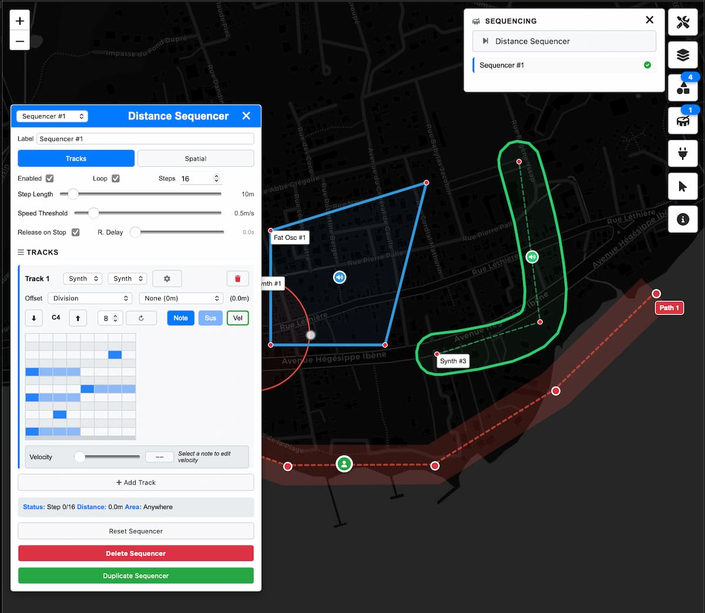

# GeoBuzz

**Spatial Music and Audio Composition Tool, where the listener is the playhead.**



Compose walkable musical pieces where arrangement happens in geographic space. Create location-based audio experiences that respond to listener's position and speed. Export the compositions and the engine as standalone web application and create your own user interface.

---

## Two-Part System

```
┌─────────────────────────┐
│   GeoBuzz Editor        │  ← Create and edit buzzes
│   (Full UI + Tools)     │
└────────────┬────────────┘
             │ Export Package
             ▼
┌─────────────────────────┐
│   RuntimeEngine         │  ← Lightweight player
│   (Audio + Spatial)     │     Custom UI ready
└─────────────────────────┘
```

---

## Quick Start

Open the [**GeoBuzz Editor**](https://janne-s.github.io/GeoBuzz/) or download the files and launch it on your machine.

### Creating a Buzz

1. Use the element menu or double click on the map to place sounds
2. Configure sound type and parameters
3. Add effects, draw paths (optional)
4. Test with GPS or simulation mode
5. Export as standalone package

See the [**Docs**](docs/) for more.

---

### Running the Editor

Serve the project via any web server and open in browser. ES modules require HTTP(S) — opening `index.html` directly via `file://` will not work. Mobile devices require HTTPS for location/orientation.

Data is stored locally in the browser using IndexedDB. Each workspace gets a unique URL you can bookmark to return later. All actions are automatically saved.

**Private/incognito mode:** IndexedDB data is discarded when the browser window closes. Workspace URLs from private sessions cannot be opened in normal mode.

**Data persistence:** On Safari, IndexedDB may be evicted after 7 days if the user hasn't visited the origin.

It's best to regularly save Buzz zip to be sure.

### Shared Workspaces Version ###

The limitations don't concern the server version. A server-based shared workspaces version is available as a drop-in kit (see `server-kit/`). Besides collaborations and data persistence, it enables easier mobile testing and publishing to the workspace.

See it live at [**GeoBuzz.app**](https://geobuzz.app)

Note that workspaces that have been unused for more than 7 days are automatically deleted on that site.

For a permanent hosted setup, run the app on your own server locally or remotely. 

Sponsoring the project helps me maintain and improve the app, and eventually provide a stable hosted solution.

### Sound Types

**Synthesizers:** Synth, FMSynth, AMSynth, FatOscillator, NoiseSynth

**Samplers:** SoundFile, Sampler, StreamPlayer

### Paths

- **Movement Paths** - Sound follows user along path
- **Control Zones** - Trigger sounds or modulate parameters
- **Modulation Paths** - LFO-based parameter automation

### Distance Sequencers

Step sequencers that advance based on walking distance rather than time. Create rhythmic patterns that play as you move through space.

---

## Exporting & Deploying

Click "Export Package" in the editor. The ZIP contains:

```
my-buzz.zip
├── buzz.json           # Buzz data
├── index.html          # Player (customize this)
├── player-styles.css   # Styles (customize this)
└── src/                # Runtime engine
```

Deploy: Extract, upload to any HTTPS web server, open in browser.

---

## RuntimeEngine API

```
import { runtimeEngine } from './src/runtime/RuntimeEngine.js';

await runtimeEngine.initialize({ mapContainer: document.getElementById('map') });
await runtimeEngine.loadBuzz(buzzData);
await runtimeEngine.start();
runtimeEngine.stop();
runtimeEngine.dispose();
```

Study the examples to know more.

---

## Examples

Working examples in [examples/](examples/):

| Example | Description |
|---------|-------------|
| [**01-minimal**](https://janne-s.github.io/GeoBuzz/examples/01-minimal/) ([Repo](examples/01-minimal/)) | Simplest implementation |
| [**02-headless**](https://janne-s.github.io/GeoBuzz/examples/02-headless/) ([Repo](examples/02-headless/)) | Audio-only, no map |
| [**03-visualizer**](https://janne-s.github.io/GeoBuzz/examples/03-visualizer/) ([Repo](examples/03-visualizer/)) | Canvas visualization |
| [**04-guided-tour**](https://janne-s.github.io/GeoBuzz/examples/04-guided-tour/) ([Repo](examples/04-guided-tour/)) | Walking tour with waypoints |
| [**05-aframe**](https://janne-s.github.io/GeoBuzz/examples/05-aframe/) ([Repo](examples/05-aframe/)) | A-Frame AR/VR integration |
| [**06-multi-buzz**](https://janne-s.github.io/GeoBuzz/examples/06-multi-buzz/) ([Repo](examples/06-multi-buzz/)) | Switch between buzzes |
| **07-osc-streaming** ([Repo](examples/07-osc-streaming/)) | Stream to DAW, Max/MSP, Pure Data |

---

## Project Structure

```
src/
├── core/                    # Shared core modules
│   ├── audio/               # Audio processing
│   ├── state/               # State management
│   ├── geospatial/          # Spatial calculations
│   └── utils/               # Utilities
│
├── runtime/                 # RuntimeEngine
│
├── ui/                      # Editor UI
├── interactions/            # Editing tools
├── events/                  # Event handling
├── selection/               # Selection management
├── layers/                  # Layer management
├── paths/                   # Path processing
├── shapes/                  # Shape handling
├── map/                     # Map management
├── simulation/              # Route simulation
├── config/                  # Configuration
├── persistence/             # Save/load/export
├── api/                     # LocalBackend (IndexedDB storage)
└── debug/                   # Debug tools
```

---

## Requirements

- Modern browser (Chrome, Firefox, Safari, Edge)
- HTTPS for geolocation and orientation features
- Web server for ES6 modules

---

## Resources

- [Tone.js](https://tonejs.github.io/)
- [Resonance Audio](https://resonance-audio.github.io/resonance-audio/)
- [Leaflet](https://leafletjs.com/)

---

The main body of work took approximately 3-4 months of daily AI-assisted development. I primarily used Claude, with occasional support from ChatGPT for prototyping and process design. I have run code cleanlines, performance and security reviews, and best practice checks at different stages of the development process. I have tried to produce the application to the best of my abilities, and welcome all suggestions for improvement.

---

## Vision

GeoBuzz aims to pioneer spatial music composition as a new creative genre — where geography, movement, and sound merge into location-aware musical experiences. We hope to grow a community of composers, developers, and sound artists exploring this space together.

---

## Support GeoBuzz

If you enjoy using GeoBuzz, you can support its development:

- **GitHub Sponsors** – fund the open-source code and improvements directly.  
  [Become a GitHub Sponsor](https://github.com/sponsors/janne-s)

- **Ko-fi** – give a one-off tip or small donation to support the project.  
  [Support on Ko-fi](https://ko-fi.com/jannesarkela)

  [](https://ko-fi.com/Z8Z21VZ78L)

Thank you for helping keep GeoBuzz alive and growing!

See [**Sanara Creations**](https://www.sanaracreations.fi/) for my multidisciplinary work, both solo and in collaboration with others.